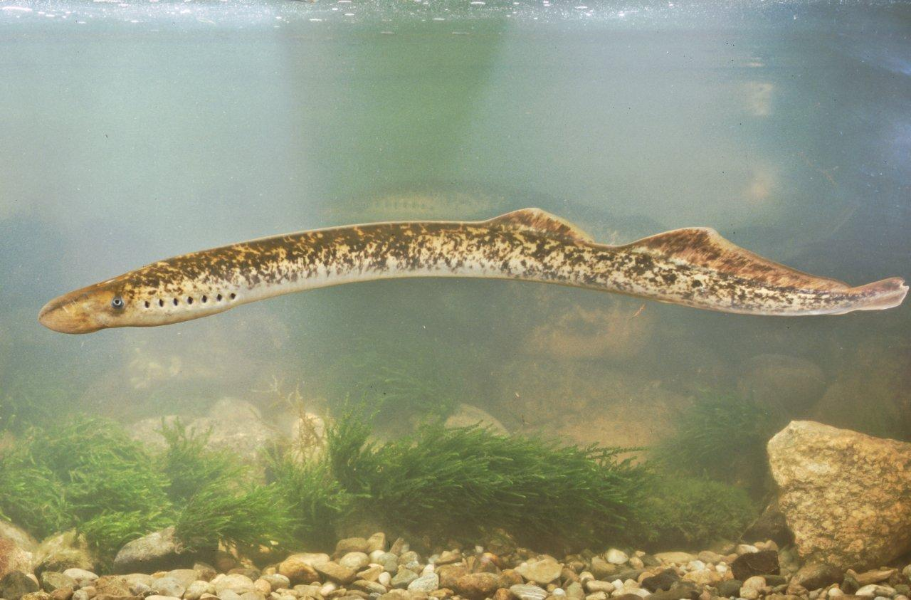
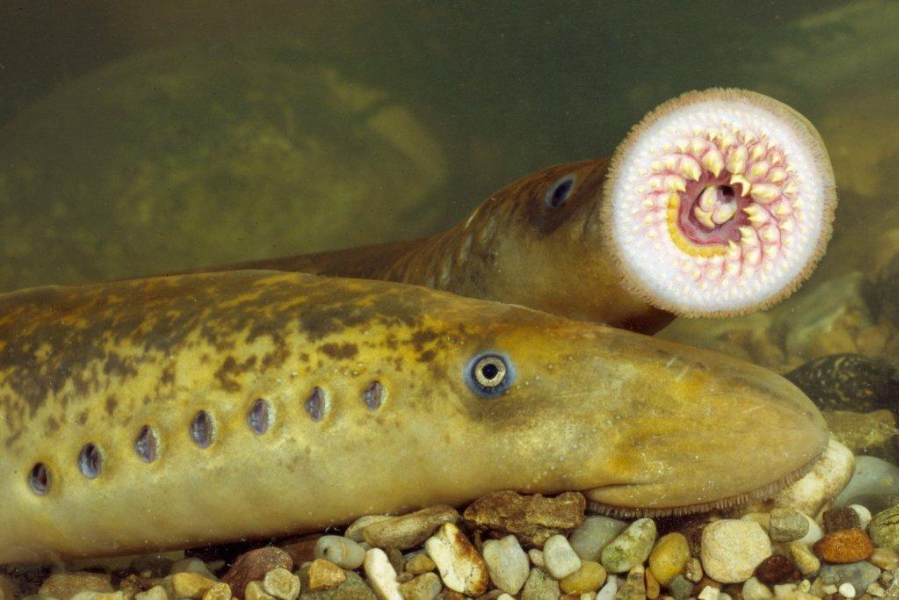
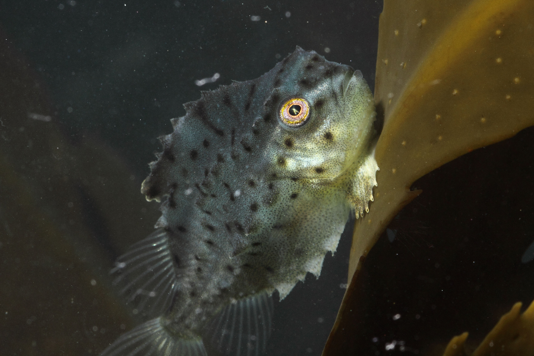
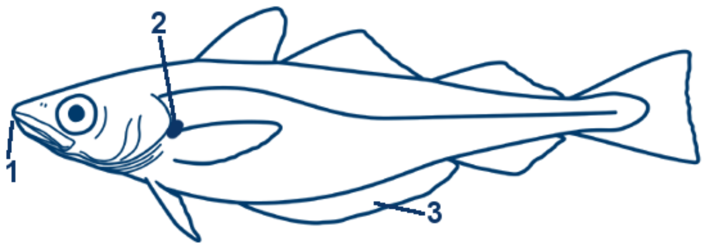

<!--
author:   Your Name

email:    your@mail.org

version:  0.0.1

language: de

-->

# Fischbestimmer

__Körper__

---

Körperform:

---

Maulstellung:

---

__Flossen__

---

Rückenflosse:

---

Bauchflosse:

---

Schwanzflosse:

---

__Färbung__

---

Farbe:

---

Musterung:

---

__Sonstiges__

---

Barteln:

---

Saugscheibe:

## A

### Aal

<!-- class="notranslate" -->
D-Aal, Flussaal, Gelbaal, Blankaal; GB-Eel, common eel, european eel; DK-Ål;
PL-Węgorz europejski; LT-Ungurys; LV-Zutis; EST-Angerjas; RU-Речной угорь;
FIN-Ankerias; S-Europeisk ål

Erkennungsmerkmale
------------------

1. Maul oberständig (der Unterkiefer überragt den Oberkiefer).
2. die Rückenflosse beginnt weit hinter dem Ende der Brustflosse.

* Kopfform variabel: zugespitzt oder breit; Färbung von hellgrau, bis
  dunkelgrau und gelb, Bauch heller.

Meist 30 bis 50 cm, max. bis 130 cm Länge.

Ähnliche Arten
--------------

__Conger__ - Maul unterständig; Rückenflosse beginnt etwa da wo die Brustflosse
endet.

__[Meerneunauge](#Meerneunauge)__ - sieben äußere Kiemenöffnungen, keine
Brustflossen.

__Flussneunauge__ - sieben äußere Kiemenöffnungen, keine Brustflossen.

Lebensweise
-----------

Die laichreifen Erwachsenen wandern flussabwärts ins Meer und ziehen in die über
5.000 km entfernte Sargassosee. Sie pflanzen sich nur einmal im Leben fort und
sterben danach. Die Larven driften mit dem Golfstrom nach Europa; die Jungaale
wandern in die Flüsse und deren Mündungsbereiche und wachsen dort heran.

Ernährung
---------

Alle Arten von bodenlebenden Organismen, Fischlaich, Fische und Aas.

Bedeutung
---------

Hohe wirtschaftliche Bedeutung als Speisefisch.

Gefährdung
----------

Durch wirtschaftliche Nutzung, sehr langsame Reproduktionsraten und
Flussverbauungen, die die Laichwanderungen stark behindern, ist der Flussaal
stark gefährdet. Der Aal kann nicht in Gefangenschaft nachgezogen werden.

## B

## C

## D

### Dorsch

<!-- class="notranslate" -->
D-Dorsch, Kabeljau; GB-Cod; DK-Torsk; PL-Dorz; LT-Mence; LV-Menca; EST-Tursk;
RU-Атлантическая треска; FIN-Turska; S-Torsk Erkennungsmerkmale

1. Lange Bartel am Kinn.
2. Maul deutlich unterständig.
3. Seitenlinie deutlich hell hervorgehoben.

* 3 Rücken- und 2 Afterflossen.
* Hellbraun, gelblich oder grünlich mit markantem dunkelbraunem Fleckenmuster.

Meist 40 bis 70 cm, früher bis 200 cm Länge und über 95 kg Gewicht.

> __Gadus morhua__
>
> Familie: Gadidae
>
> Ordnung: Gadiformes
>
> 
>
> Verbreitung: Gesamte Ostsee, außer im nördlichen Bottnischen Meerbusen.
>
> Häufigkeit: sehr häufig
>
> Gefährdung: nicht gefährdet

Ähnliche Arten
--------------

__[Wittling](#Wittling)__ - Bartel sehr klein oder fehlend; Seitenlinie nicht weiß.

__Schellfisch__ - Bartel kleiner; Seitenlinie nicht weiß; mit markantem
schwarzen Fleck über der Brustflosse.

__Franzosendorsch__ - Schnauze nur etwa so lang wie Augendurchmesser;
Seitenlinie nicht weiß.

__Zwergdorsch__ - Schnauze nur etwa so lang wie Augendurchmesser; Seitenlinie
nicht weiß.

Lebensweise
-----------

Meist in Schwärmen bodennah in bis zu 600 m Tiefe. Laicht im Frühjahr mit bis zu
5 Millionen Eier pro Weibchen. Jungfische meist in flacherem Wasser. Die
Lebensweisen der verschiedenen Stämme im Atlantik, der Ostsee und Pazifik
unterscheidet sich stark. In der Ostsee stellt das Bornholmer Becken während der
Sommermonate den wichtigsten Laichgrund dar. Lebenserwartung bis 25 Jahre.

Ernährung
---------

Kleinere Fische, wie Heringe und Sandaale, Krabben, Garnelen, Würmer und
Muscheln.

Bedeutung
---------

Als beliebter Speisefisch kommerziell stark genutzt ; in der Ostsee einer der wichtigsten Nutzfischarten. Früher vor allem getrocknet als "Stockfisch" und "Klippfisch" gehandelt.

Gefährdung
----------

Bestände rückläufig; vor allem durch Fischerei, aber auch wegen
Gewässerverschmutzung und Habitatzerstörung.

## M

### Meerneunauge

<!-- class="notranslate" -->
D-Meerneunauge; GB-Sea lamprey, great sea lamprey, green sea lamprey;
DK-Havlempret; PL-Minóg morski; LT-Upinė nėgė; LV-Jūras nēģis; EST-Merisutt;
RU-Минога морская; FIN-Merinahkiainen; S-Havsnejonöga Erkennungsmerkmale

1. Mundscheibe mit zahlreichen kleinen Hornzähne.

* 7 Kiemenöffnungen (pro Seite) und eine einzelne Nasenöffnung.
* Keine paarigen Flossen.
* Körper meist deutlich marmoriert.

Meist 70 bis 90 cm, selten bis 120 cm; etwa 5 cm im Durchmesser.

Ähnliche Arten
--------------

__Flussneunauge__ - drei Paar große Hornzähne beiderseits der Maulöffnung; Körper
einheitlich gefärbt; nur etwa daumendick.

__Aal__ - paarige Brustflossen; Kiemendeckel und nur eine äußere Kiemenöffnung.

__Conger__ - paarige Brustflossen; Kiemendeckel und nur eine äußere
Kiemenöffnung.

Lebensweise
-----------

Die laichreifen Erwachsenen wandern flussaufwärts. Sie pflanzen sich nur einmal
im Leben fort. Die Larven, die sogenannten Querder, leben drei bis fünf Jahre in
Sand- oder Schlammgrund eingegraben und ernähren sich filtrierend von
Kleinstpartikeln. Nach der Umwandlung zum Erwachsenen wandern sie zurück ins
Meer und leben dort bis zur Geschlechtsreife etwa drei bis vier Jahre lang.

Ernährung
---------

Saugt sich mit der Mundscheibe an Fische an, um sich von deren Blut und
kleingeraspelten Gewebe zu ernähren. Kleinere Fische werden teilweise auch
komplett gefressen.

Bedeutung
---------

Geschätzter Speisefisch; wegen seiner geringen Bestände jedoch kaum
wirtschaftlich nutzbar.

Gefährdung
----------

Gefährdet durch Flussverbauung (z.B. Wasserkraftwerke) und
Gewässerverschmutzung.

## S

### Seehase

<!-- class="notranslate" -->
D-Seehase; GB-Lumpsucker, Lumpfish; DK-Stenbider; PL-Tasza; LT-Ciegorius;
LV-Zaķzivs; EST-Merivarblane; RU-Пинагор; FIN-Rasvakala; S-Sjurygg

Erkennungsmerkmale
------------------

1. Reihen von Knochendornen auf Rücken und Flanken.
2. Bauchflossen sind zu einer Saugscheibe umgewandelt.

* Jungtiere mit zwei Rückenflossen; die erste wird während des Wachstums von einem
  Hautkamm umwachsen.
* Körper massig und hochrückig.

Männchen meist 30 bis 40 cm, Weibchen meist über 50 cm, max. 61cm Länge; in der
Ostsee meist kleiner bleibend.

> __Cyclopterus lumpus__
>
> Familie: Cyclopteridae
>
> Ordnung: Scorpaeniformes
>
> 
>
> Verbreitung: Häufig in der gesamten Ostsee mit Ausnahme des finnischen und
> bottnischen Meerbusens.
>
> Häufigkeit: sehr häufig
>
> Gefährdung: nicht gefährdet

Ähnliche Arten
--------------

- Unverwechselbar

Lebensweise
-----------

Lebt auf steinigen bis felsigen Böden in 20 bis 200m, max. 400 m Tiefe, wo er
sich mit seiner Saugscheibe festsaugen kann. Laicht im Frühjahr, das Gelege von
bis zu 350.000 Eiern wird vom Männchen bewacht. Die Wintermonate verbringen sie
in größeren Tiefen.

Ernährung
---------

Krebstiere, Rippenquallen und kleine Fische; gelegentlich pflanzliches Material.

Bedeutung
---------

Wirtschaftliche Bedeutung als Speisefisch; seine Eier werden als "deutscher
Kaviar" gehandelt.

Gefährdung
----------

Vermutlich nicht gefährdet.

Bermerkung
----------

Meist sind Seehasen gräulich oder grünlich gefärbt, doch während der
Fortpflanzungszeit werden die Männchen leuchtend rot.

## W

### Wittling

<!-- class="notranslate" -->
D-Wittling, Merlan; GB-Whiting, merling; DK-Hvilling; PL-Witlinek; LV-Merlangs; EST-Merlang; RU-Мерланг; FIN-Valkoturska; S-Vitling
Erkennungsmerkmale

1. Maul unterständig.
2. Kleiner schwarzer Fleck an der Basis der Brustflosse.
3. Erste Afterflosse etwa eineinhalb mal so lang wie die zweite Rückenflosse.
4. Kinnbartel sehr klein (bei Jungtieren) oder fehlende (bei Erwachsenen).
5. 3 Rücken- und 2 Afterflossen.
6. Seiten silbern; Rücken grünlich glänzend; Bauchseite heller.

Meist etwa 30 bis 40 cm, maximal bis zu 70 cm lang.

Ähnliche Arten
--------------

___Köhler___ - Maul oberständig; erste Afterflosse nur geringfügig länger als
zweite Rückenflosse.

___Pollack___ - Maul oberständig; erste Afterflosse nur geringfügig länger als
zweite Rückenflosse.

___Schellfisch___ - großer schwarzer Fleck über der Mitte der Brustflosse; erste
Afterflosse nur geringfügig länger als zweite Rückenflosse.

___Blauer Wittling___ - weiter Abstand zwischen zweiter und dritter Rückenflosse
(berühren sich beim Wittling); erste Afterflosse etwa 4-mal so lang wie zweite
Rückenflosse; nie mit Kinnbartel.

Lebensweise
-----------

Lebt bodennah in Schwärmen bis in eine Tiefe von 200 m. Laicht im Frühjahr mit
etwa 1 Million Eiern pro Weibchen. Jungtiere halten sich gerne unter
Schirmquallen auf. Wird bis zu 20 Jahre alt.

Ernährung
---------

Ernährt sich von anderen Fischen, wie Heringen oder jungen Dorschartigen, aber
auch von Krebstieren.

Bedeutung
---------

Wichtiger Speisefisch.
